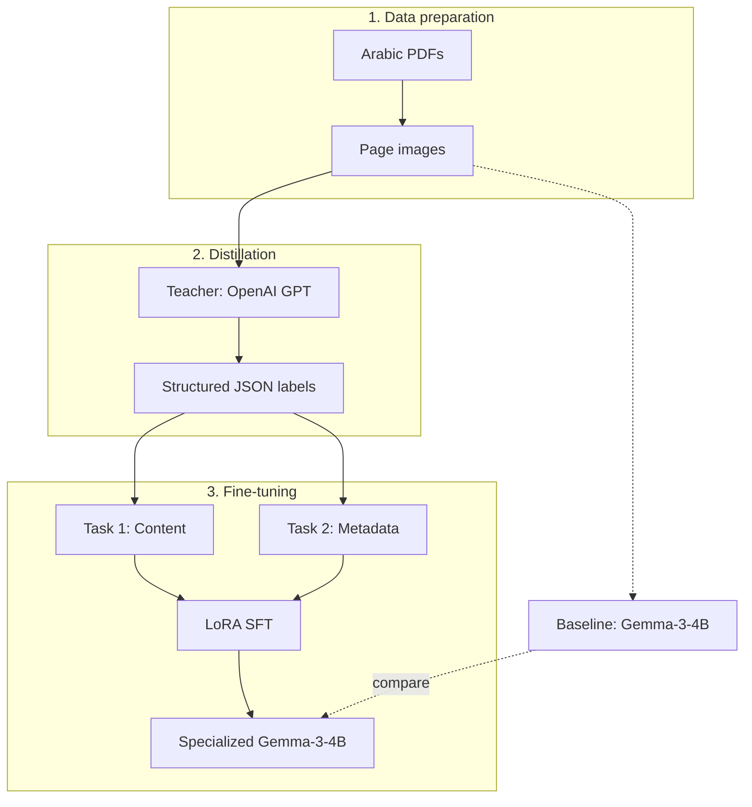

# Fine-Tuning a Vision-Language Model for Arabic OCR

## Why fine-tune?

Large cloud VLMs already read Arabic well, but they are expensive, and every document you process is sent to a third-party API. Small open models are cheap and can run locally, but they make too many mistakes on specialized documents.

This project closes that gap. It uses **knowledge distillation** to turn `Gemma-3-4B-it` into a specialist for Arabic administrative and legal documents. These documents are hard for general models because they contain:

- stamps, seals, and watermarks overlapping the text
- dense legal terminology
- Hijri and Gregorian dates
- scanned pages of uneven quality

**Teaching a small open model to read Arabic legal documents, using a large model as its teacher.**

  
   
  Sample input: an official Arabic regulation page

## Pipeline

1. **Prepare.** Convert each PDF page to an image, then apply grayscale, resizing to 600px wide, and a contrast boost.
2. **Baseline.** Run the untouched Gemma-3 model on the pages to measure where it fails.
3. **Distill.** A teacher model extracts a detailed JSON for every page, covering text, tables, dates, stamps, signatures, and references. Generation stops automatically when it reaches a set budget.
4. **Build the dataset.** Split each label into two focused tasks: *content* (text and page structure) and *metadata* (classification, source, marks, signatures). The train/val split is done by document, so pages of the same document never appear in both sets.
5. **Fine-tune.** Train with LoRA via LlamaFactory.

## Baseline: where the base model fails

The base model gets the layout right but makes errors in the words themselves:

| Ground truth | Gemma-3 output | Error type |
|---|---|---|
| المؤجر | المؤبر | similar letters (ج/ب) |
| المنقولة | المتقولة | missing dot |
| الموجودات | المودودات | letter substitution |
| الإيجار التمويلي | الإيجار التعويضي | wrong word (hallucination) |

It also missed metadata such as the document number and attachments, and stopped before the end of the page. That level of accuracy is not acceptable for legal text.

## Training setup

| | |
|---|---|
| Base model | `google/gemma-3-4b-it` |
| Method | SFT with LoRA (rank 96, all linear layers) |
| Learning rate | 1e-4, cosine schedule, 10% warmup |
| Effective batch size | 8 (1 × 8 gradient accumulation) |
| Context length | 12,000 tokens |
| Precision | bf16 |

## Results

*Coming soon: fine-tuned vs. base model comparison.*

## Stack

`transformers` · `LlamaFactory` · `PyTorch` · `OpenAI API` · `pdf2image` · `Pillow` · `json-repair` · `Weights & Biases`

## Limitations

- The dataset is small (22 samples). More documents would give a stronger model.
- Training at a 12k context needs more GPU memory than a free Colab T4 provides. QLoRA is a possible workaround.
- Evaluation is qualitative for now. CER/WER metrics are planned.