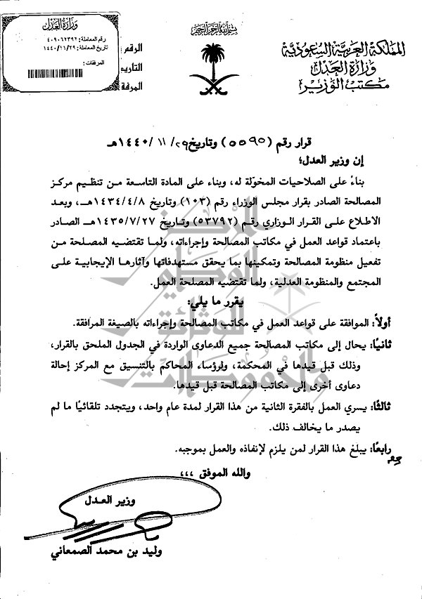
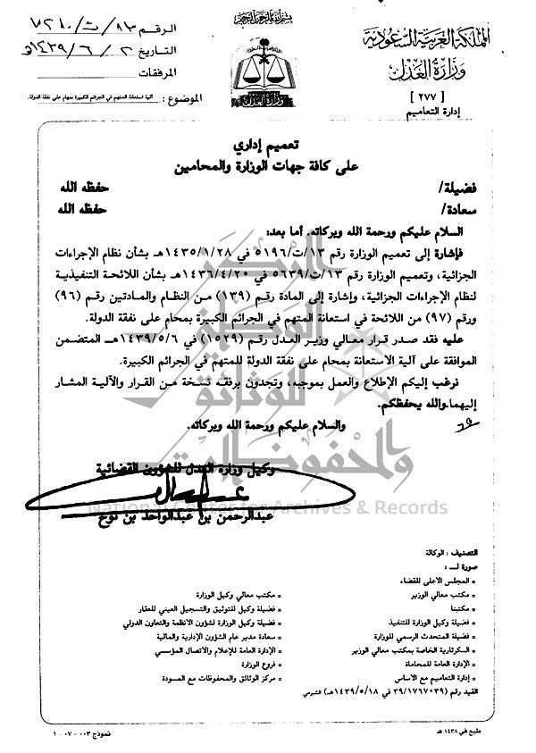
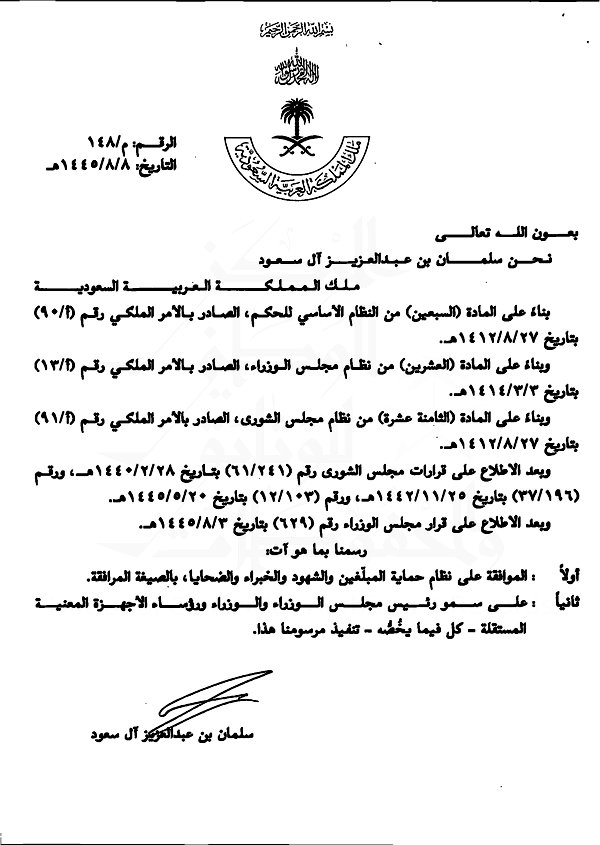
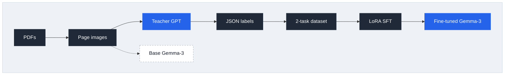

# Fine-Tuning a Vision-Language Model for Arabic OCR

**Teaching a small open model to read Arabic legal documents, using a large model as its teacher.**

## Why fine-tune?

Large cloud VLMs already read Arabic well, but they are expensive, and every document you process is sent to a third-party API. Small open models are cheap and can run locally, but they make too many mistakes on specialized documents.

This project closes that gap. It uses **knowledge distillation** to turn `Gemma-3-4B-it` into a specialist for Arabic administrative and legal documents. These documents are hard for general models because they contain:

- stamps, seals, and watermarks overlapping the text
- dense legal terminology
- Hijri and Gregorian dates
- scanned pages of uneven quality

## The data

The dataset is a set of scanned Arabic legal and administrative PDFs. Each page is converted to an image, and that image is the model's input.

[Download the data on Hugging Face](https://huggingface.co/bakrianoo/arabic-legal-documents-ocr-1.0/tree/main)

<table>
  <tr>
    <td align="center" width="33%">
      
      <br/><sub><b>Document 0005</b></sub>
    </td>
    <td align="center" width="33%">
      
      <br/><sub><b>Document 0007</b></sub>
    </td>
    <td align="center" width="33%">
      
      <br/><sub><b>Document 0067</b></sub>
    </td>
  </tr>
</table>

## Pipeline



| Step | Script | What it does |
|---|---|---|
| 1 | `01_prepare_images.py` | Converts each PDF page to an image: grayscale, 600px wide, contrast boost. |
| 2 | `02_eval_base_model.py` | Runs the untouched base model on a sample page to see where it fails. |
| 3 | `03_eval_teacher_model.py` | Runs the teacher model on the same page to check its output quality and cost. |
| 4 | `04_generate_labels.py` | The teacher extracts a detailed JSON for every page: text, tables, dates, stamps, signatures, and references. Stops at a set budget. |
| 5 | `05_build_dataset.py` | Splits each label into two tasks, **content** (text and page structure) and **metadata** (classification, source, marks, signatures). The train/val split is done by document, so pages of one document never appear in both sets. |
| 6 | `training/train.sh` | Fine-tunes the base model with LoRA via LlamaFactory. |

## Baseline: where the base model fails

The baseline model is **`google/gemma-3-4b-it`**: small enough to fine-tune and run locally, and it supports images and Arabic.

It gets the layout right but makes errors in the words themselves:

| Ground truth | Gemma-3 output | Error type |
|---|---|---|
| المؤجر | المؤبر | similar letters (ج/ب) |
| المنقولة | المتقولة | missing dot |
| الموجودات | المودودات | letter substitution |
| الإيجار التمويلي | الإيجار التعويضي | wrong word (hallucination) |

It also missed metadata such as the document number and attachments, and stopped before the end of the page. That level of accuracy is not acceptable for legal text.

## Training setup

| | |
|---|---|
| Base model | `google/gemma-3-4b-it` |
| Framework | LlamaFactory |
| Method | SFT with LoRA (rank 96, all linear layers) |
| Learning rate | 1e-4, cosine schedule, 10% warmup |
| Epochs | 20 |
| Effective batch size | 8 (1 × 8 gradient accumulation) |
| Context length | 12,000 tokens |
| Precision | bf16 |

## Results

Training has not been completed yet. This section will compare the fine-tuned model with the base model on the validation pages.

## Stack

| Purpose | Tools |
|---|---|
| PDF to images | `pdf2image`, `Pillow` |
| Base model | `transformers`, `PyTorch` |
| Teacher model | OpenAI API |
| Data cleaning | `json-repair` |
| Fine-tuning | LlamaFactory, LoRA |
| Tracking | Weights & Biases |

## Project organization

```
.
├── data/
│   ├── pdfs/                  # source PDFs
│   ├── img/                   # page images (step 1)
│   ├── outputs/               # base vs. teacher outputs (steps 2-3)
│   ├── labels/                # teacher labels, JSONL (step 4)
│   └── datasets/              # train.json, val.json (step 5)
├── prompts/
│   ├── baseline_ocr.md        # prompt for the base model test
│   ├── teacher_extraction.md  # prompt for the teacher (steps 3-4)
│   ├── task1_content.md       # student task 1
│   └── task2_metadata.md      # student task 2
├── src/
│   ├── config.py              # paths, model names, budget
│   ├── utils.py               # shared helpers
│   ├── 01_prepare_images.py
│   ├── 02_eval_base_model.py
│   ├── 03_eval_teacher_model.py
│   ├── 04_generate_labels.py
│   └── 05_build_dataset.py
├── training/
│   ├── dataset_info.json      # LlamaFactory dataset entries
│   ├── lora_config.yaml       # training parameters
│   └── train.sh               # installs LlamaFactory and trains
├── notebooks/                 # original notebook
├── requirements.txt
└── .env                       # HF_TOKEN, OPENAI_API_KEY (not committed)
```

To run the full pipeline:

```bash
pip install -r requirements.txt
python src/01_prepare_images.py
python src/02_eval_base_model.py
python src/03_eval_teacher_model.py
python src/04_generate_labels.py
python src/05_build_dataset.py
bash training/train.sh
```

## Limitations

- **Small dataset.** About 11 labeled pages (22 samples), limited by the teacher's API budget. More documents would give a stronger model.
- **GPU memory.** Training at a 12,000-token context ran out of memory on a free Colab GPU. A shorter context, a lower LoRA rank, or QLoRA would reduce memory use.
- **No quantitative evaluation yet.** The baseline analysis is qualitative. CER/WER metrics are planned.